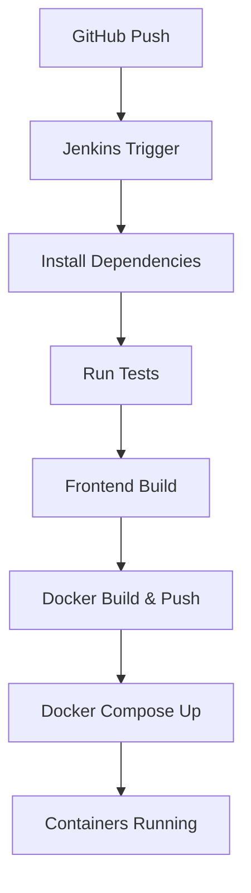

# Surplus Food Redistribution Platform

## Overview

Food waste is a significant global challenge, while millions continue to struggle with hunger. Our digital platform bridges the gap between surplus food sources—such as restaurants, bakeries, caterers, and canteens—and NGOs, shelters, and volunteers who work to distribute food to those in need. By leveraging real-time tracking, optimized routing, and AI-driven inventory management, our platform ensures that surplus food is efficiently redistributed before spoilage occurs.

🌐 [Live Demo: Nourish AI](https://aissms-pune-hack.vercel.app/)

---

## Key Features

### 🎯 Role-Based Access & Registration
- **Donors:**  
  Upload details about surplus food (expiry, pickup time).
- **Recipients:**  
  NGOs, shelters, and volunteers claim food based on need.
- **Communication:**  
  Real-time scheduling and notifications between users.

### 🚚 Real-Time Food Redistribution & Optimization
- **Geolocation & Route Optimization:**  
  Google Maps API integration for efficient collection.
- **Smart Alerts:**  
  Notify donors when food is nearing expiry.
- **Live Tracking:**  
  Track donation status in real-time.

### 🤖 AI-Powered Food Management
- **Predictive Analytics:**  
  Optimize donations using past trends.
- **Smart Recipe Chatbot:**  
  Suggest recipes based on available ingredients.

### 🔁 Seamless Pickup & Distribution
- Efficient claiming and route assignment.
- Transparent delivery tracking and status updates.

---

## 🧑‍💻 Technology Stack

- **Frontend:** React.js, Vite
- **Backend:** Node.js, Express.js
- **Database:** MongoDB
- **APIs & Integrations:**
  - Google Maps API (geolocation & routing)
  - Twilio (SMS alerts)
  - AI/ML Models (prediction + chatbot)
  - OCR tools (for optional inventory digitization)

---

## 🛠️ Installation & Setup

### Prerequisites
- [Node.js](https://nodejs.org/) (LTS)
- [MongoDB](https://www.mongodb.com/)
- [Docker](https://www.docker.com/) (optional)
- [Git](https://git-scm.com/)

---

### 🚀 Running Locally

#### 1. Clone the Repository
```bash
git clone https://github.com/yourusername/your-repo-name.git
cd your-repo-name
```

#### 2. Backend Setup
```bash
cd Backend
npm install
```

Create `.env` file:
```env
PORT=4000
MONGO_URL=mongodb://localhost:27017/mydatabase
```

Start the backend:
```bash
npm start
```

#### 3. Frontend Setup
```bash
cd ../Frontend
npm install
```

Create `.env` file:
```env
VITE_BASE_URL=http://localhost:4000/api/v1
```

Run dev server:
```bash
npm run dev
```

Production build:
```bash
npm run build
npm run preview -- --port 5173
```

---

## 🐳 Docker Deployment

### docker-compose.yml
```yaml
version: '3.8'

services:
  backend:
    build:
      context: ./Backend
      dockerfile: Dockerfile
    container_name: backend
    ports:
      - "4000:4000"
    environment:
      - PORT=4000
      - MONGO_URL=mongodb://mongo:27017/mydatabase
    depends_on:
      - mongo
    volumes:
      - ./Backend:/src

  mongo:
    image: mongo:latest
    container_name: mongo
    ports:
      - "27017:27017"
    volumes:
      - mongo-data:/data/db

  frontend:
    build:
      context: ./Frontend
      dockerfile: Dockerfile
    container_name: frontend
    ports:
      - "5173:5173"
    volumes:
      - ./Frontend:/src

volumes:
  mongo-data:
```

Start with:
```bash
docker-compose up --build
```

Access:
- **Backend:** http://localhost:4000  
- **Frontend:** http://localhost:5173  

---

## 🔁 CI/CT/CD Pipeline



---

## ✅ Sample Test Output

### Backend
```bash
✓ should return 200 for the root endpoint
✓ should fetch top individual donors
✓ should fetch top restaurant donors
✓ should return 404 for an unknown route
```

### Frontend
```bash
✓ HomePage.test.jsx
✓ Renders carousel with correct titles
✓ Fetches leaderboard data on mount
```

---

## 🧾 Docker Logs
```bash
MongoDB connected: mongo
Server running at http://localhost:4000
Twilio Auth Token: Loaded
Frontend served at http://localhost:5173
```

---

## 👥 Team Members

| Name | Role | Responsibilities |
|------|------|------------------|
| Atharva Jamdade | Full Stack Lead | Backend logic, MongoDB, Jenkins CI/CD |
| [Your Teammate] | Frontend Developer | UI/UX, React, Vite |
| [Your Teammate] | DevOps Engineer | Docker, Jenkins, Deployment |
| [Your Teammate] | AI/ML Specialist | Predictive Models, Recipe Chatbot |

---

## 🚀 Impact & Future Scope

- **Social Impact:**  
  Supports undernourished populations while reducing food waste.

- **Business Impact:**  
  Businesses get insights to optimize food operations.

- **Future Additions:**
  - Mobile app with push notifications
  - Volunteer leaderboard and incentives
  - Deep learning food recognition from images
  - City-level expansion via cloud deployments

---

## 📄 License

MIT License

---

## 📬 Contact

For queries or collaborations, reach out:  
📧 [jamdadeatharva14@gmail.com](mailto:jamdadeatharva14@gmail.com)